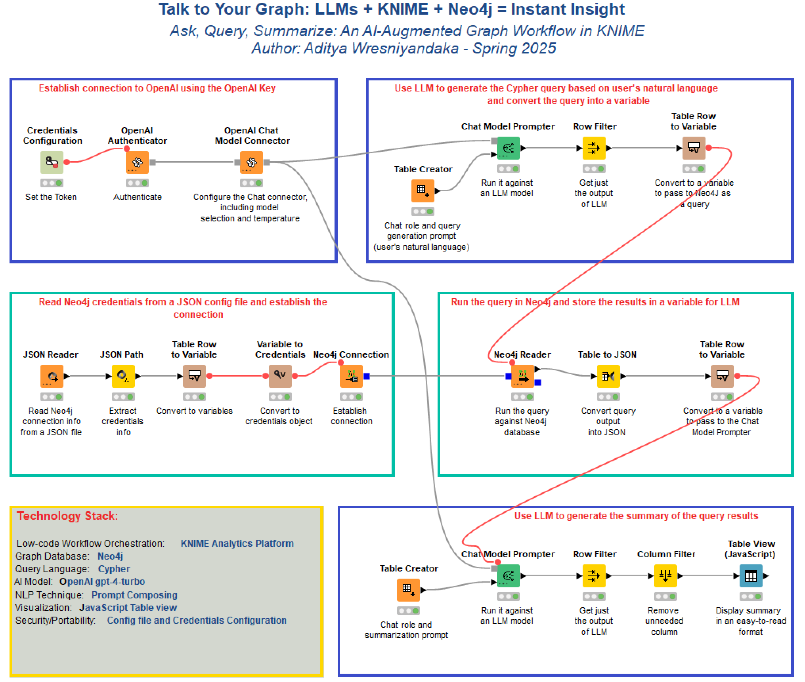
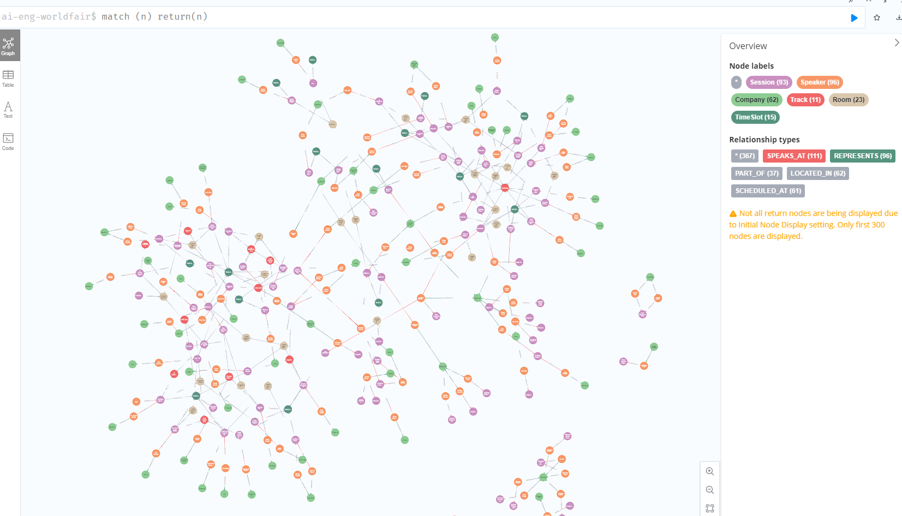
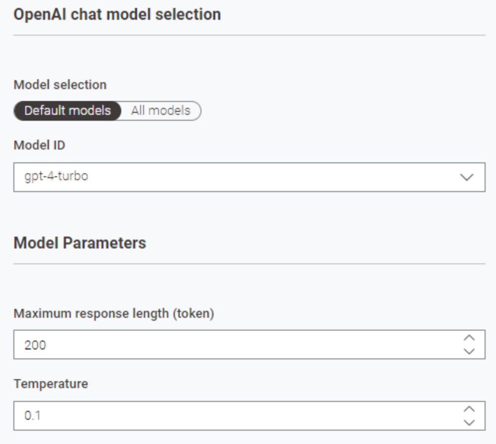
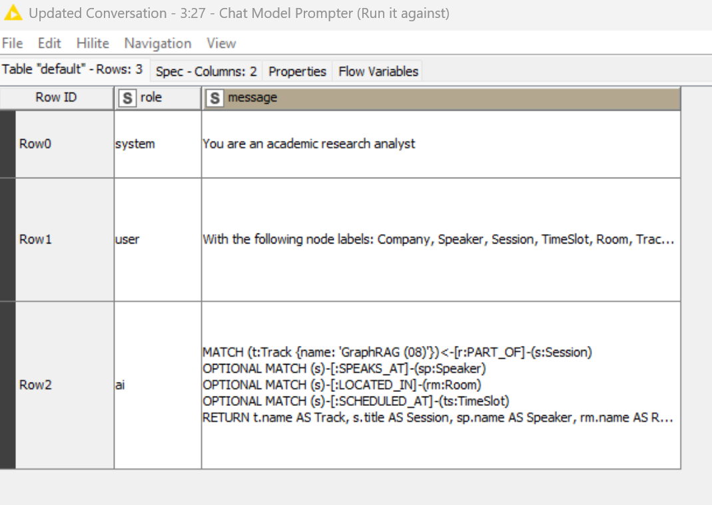
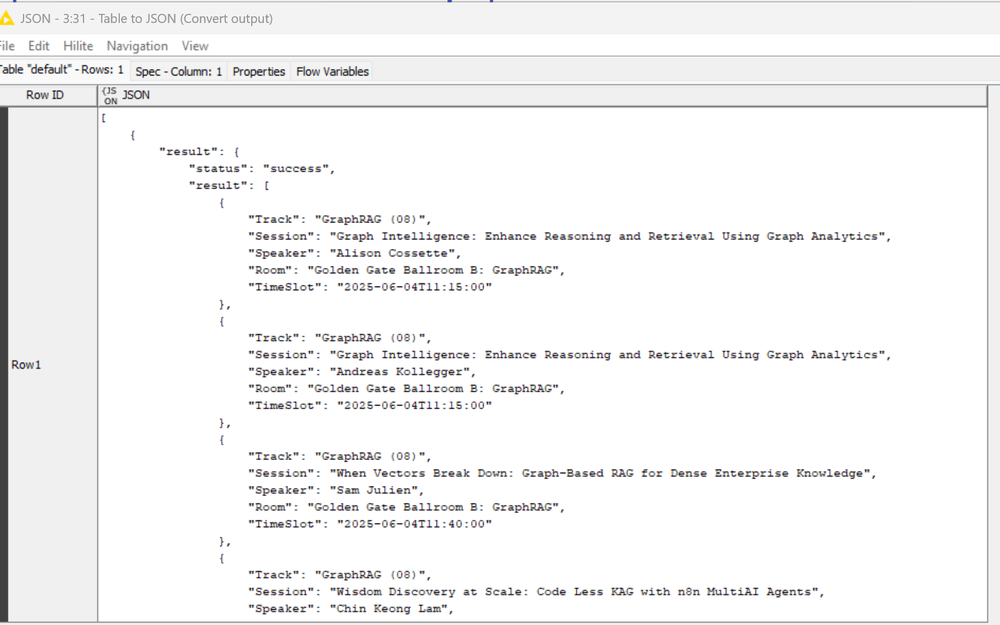
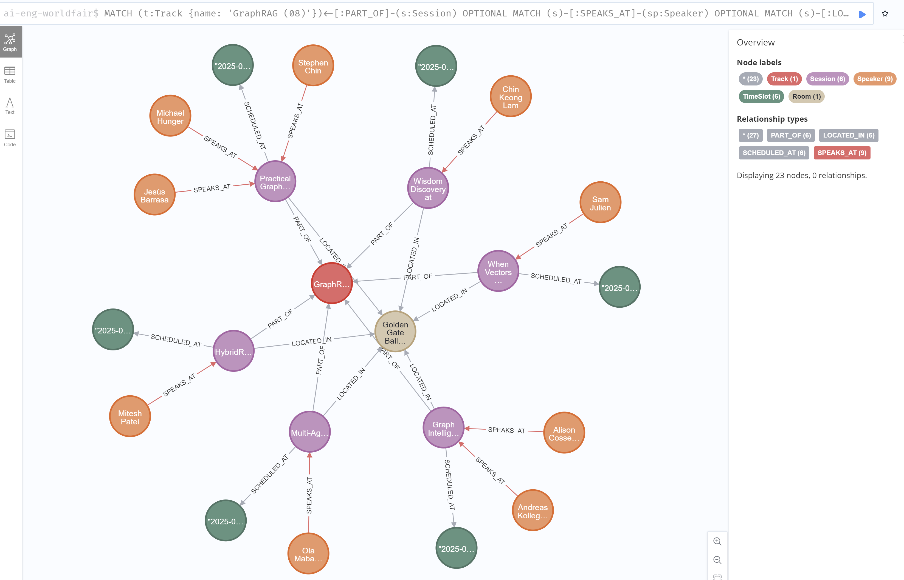
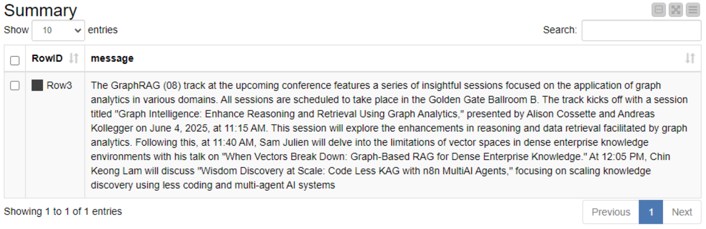

# Cyphermind
Cyphermind is a KNIME-based workflow that uses prompt engineering and LLMs to dynamically generate Cypher queries for Neo4j graph database summarization.

## Author: Aditya Wresniyandaka - Spring 2025

## 🚀 Features

- 💬 **Prompt-to-Cypher**: Use LLMs to turn natural language prompts into Cypher queries.
- 🧠 **Automated Summarization**: Get human-readable summaries of complex graph relationships.
- 🛠️ **KNIME Workflow**: Modular and portable design using open-source KNIME Analytics Platform.
- 🔗 **Secure Neo4j & OpenAI Integration**: Credentials managed externally via JSON for portability.
- 📊 **Interactive Visualization**: View results in a clean tabular format.

<br>


## 📂 Project Structure

```bash
cyphermind/
├── knime/  
│   └── Cyphermind_Workflow.knwf    # Main KNIME workflow
├── data/
│   └── worldeng2025.json           # Sample dataset to load into Neo4j
├── scripts/
│   └── load_to_neo4j.py            # Script to import JSON data to Neo4j
├── prompts/
│   └── example_prompts.md          # Prompt templates used in the workflow
├── config/
│   └── credentials.json            # External credential store
├── images/
│   └── various png files           # Images used in this document
├── README.md
└── LICENSE
```

## 🧭 Purpose & Application Scenario
Cyphermind is a KNIME-based workflow that integrates <b>Neo4j graph database, LLMs (Large Language Models)</b>, and <b>prompt composing/engineering</b> to dynamically generate Cypher queries, execute them, and summarize results — all in no-code/low-code environment.

This workflow was designed to address a common challenge in working with graph data:

> “How do I explore relationships in my Neo4j database without writing Cypher by hand?”

✨ Use Case: AI & Engineering World Fair
This workflow is demonstrated using a Neo4j dataset representing the AI & Engineering World's Fair 2025, including nodes like: Company, Speaker, Session, Track, Room, TimeSlot, and relationships like REPRESENTS, SPEAKS_AT, SCHEDULED_AT, and PART_OF.

By simply crafting a natural language prompt such as:

> "With the following nodes and relationships, give me a summary of all relationships for the Track named 'GraphRAG (08)', including the speakers and the topics they are going to present."

Cyphermind uses OpenAI's LLM to generate the appropriate Cypher query (to query a Neo4j database) and summarize the results in plain English.

> 🔧 This workflow serves as a flexible framework — you're not limited to OpenAI’s LLM and can easily substitute other language models or APIs as needed. Note that an OpenAI subscription is required to connect to the API.

## 🎯 Ideal For:
<ul>
<li>Data analysts exploring graph patterns without Cypher experience.
<li>AI teams integrating prompt engineering with graph reasoning.
<li>Educators demonstrating practical LLM + Knowledge Graph applications.
<li>KNIME users showcasing multimodal data workflows.
</ul>

## 🛠 Requirements & Setup
### 🔗 Prerequisites
To run this workflow smoothly, you'll need:
<ul>
<li>KNIME Analytics Platform (I built this with KNIME Analytics Platform 5.4.4). You can download from: https://www.knime.com/downloads
<li>A basic understanding of:
<ul>
<li>Graph databases (Neo4j concepts).
<li>Prompt creation and LLM workflows in KNIME.
</ul>
<li>Installation and access to:
<ul>
<li>A Neo4j database (local or remote).
<li>An OpenAI API key (or compatible LLM provider).
</ul>
</ul>

### 📦 Required KNIME Extensions
Ensure the following KNIME nodes are installed:
<ul>
<li>KNIME OpenAI Integration (or generic REST node alternative) - from KNIME Extensions.
<li>KNIME Neo4j Integration - from KNIME Extensions.
<li>KNIME JavaScript Views (for Table View node) - this should be part of the base KNIME installation.
</ul>

> 💡 You can install these via KNIME Extension Manager under File > Install KNIME Extensions.

## 🗂 Data Source
<p>
The dataset used in this workflow represents sessions, speakers, companies, and tracks from the AI & Engineering World's Fair 2025, in JSON (https://ai.engineer/sessions-speakers-details.json).

🧩 A Python script to load the JSON into Neo4j is included in this repository under /data-loader/.

## 🚀 Quick Setup in Neo4j Desktop
After downloading, installing and activating Neo4j desktop, follow these steps to prepare your Neo4j environment:
<ol>
<li>Create a Project:
<ul>
<li>Open Neo4j Desktop.
<li>Click on "New" > "Project".
<li>Name your project (e.g., AI-Eng-WorldFair).
</ul>
<li>Create a DBMS and the database:
<ul>
<li>Inside the project, click "Add" > "Local DBMS".
<li>Choose a name (e.g., WorldFairGraph).
<li>Set a password (you'll use this in KNIME later).
<li>Click "Create", then "Start" the DBMS.
<li>Once the DBMS is running, click on the link to create the database. In this exercise, I named the database 'ai-eng-worldfair' (this name is specified in the Python code used to load the data).
<li>Click on the blue Open button to bring up the Neo4j Browser.
<li>Run the command: <b>SHOW DATABASES</b> to validate that the database has been created and the status is online.
</ul>
</ol>

## 🚀 Load Data into Neo4j database
You can use the Python code in this repository to load the data in the worldeng2025.json to the database previously created. 
The code was developed and tested with Python 3.12 and 3.13. You will need to install the neo4j library (for example, using the command: <i>pip install neo4j</i>)
Clone and place these files in your local directory: 
<ul>
<li>credentials.json: update the credentials info .
<li>worldeng2025.json: the actual data.
<li>load_neo4j.py: the Python code that loads the data to Neo4j.
</ul>
If the Python code runs with errors, you can check the nodes in Neo4j with these commands:
<ul>
<li>Activate the database, for example: <b>:use ai-eng-worldfair</b>.
<li>Cypher command: <b>MATCH (n) RETURN (n) LIMIT 10</b>.
</ul>
You should see a complex graph similar to the following:
<br><br>


## 🚀 Import and Run KNIME Workflow
Follow these steps to import the KNIME workflow <b>Cyphermind_workflow.kwnf</b> to your local KNIME workspace and update credentials to connect to your Neo4j database and OpenAI:
<ul>
<li>Start KNIME and select "File - Import KNIME Workflow". Specify the location of the downloaded workflow from this repository. You can use the Default destination, which is your KNIME Local workspace.
<li>Open the first node "Credentials Configuration" labeled with "Set the Token", and paste in your Open AI Key (it typically starts with <b>"sk-"</b>).
<li>Open the node "JSON Reader" labeled with "Read Neo4j connection info from a JSON file", and specify the location of your <b>credentials.json</b> file (you used earlier to upload data to Neo4j).
</ul>
Once the above steps are completed, you can run the workflow by going to the last node "Table View (JavaScript)", right-click and select "Execute and Open Views" from the drop-down.

## 🧩 How It Works
This KNIME workflow integrates Neo4j and a Large Language Model (LLM) to perform the following steps (refer to the workflow diagram in the beginning of this document):
<ul>
<li>Prompt Composition: A predefined system/user prompt is crafted to describe the graph structure and the analytical question.
<li>Query Generation with LLM: The prompt is sent to the LLM (OpenAI or compatible) to dynamically generate a Cypher query.
<li>Cypher Query Execution: The generated query is executed against the connected Neo4j database to retrieve structured graph data.
<li>LLM-based Summarization: The results are sent back to the LLM to produce a readable summary, providing context or insight.
<li>Result Display: A final JavaScript-based Table View displays both the tabular result and the generated summary.
</ul>

> 🛠️ The workflow is modular—swap out the LLM provider or update the prompts to suit your use case.

The workflow uses the gpt-4-turbo model<sup>** see notes below</sup>. You can change the model and adjust the token length and temperature settings in the "OpenAI chat model selection" node.
<br><br>


#### ⚠️ Note on Model Behavior and Cypher Output
<p>
Different GPT models may generate slightly different Cypher queries, even with the same prompt.

> For example:
<ul>
<li>GPT-4 Turbo typically returns simpler, more flattened Cypher queries by default, often without requiring additional constraints (see screenshot below).
<li>GPT-4.1 tends to include aggregate functions like COLLECT() or return full path objects (RETURN p) when asked to summarize or return related data.
To avoid this, explicitly instruct the model in your prompt:
<ul>
<li>"Do not use aggregate functions like COLLECT() unless necessary."
<li>"Return each node and relationship as separate fields, not as path objects (i.e., avoid RETURN p)."
</ul>
Sample Cypher query generated by GPT 4.1 without the additional instructions in the prompt:

```
MATCH (t:Track {name: 'GraphRAG (08)'})
OPTIONAL MATCH (t)-[:PART_OF]-(s:Session)
OPTIONAL MATCH (s)-[:SPEAKS_AT]-(sp:Speaker)
OPTIONAL MATCH (sp)-[:REPRESENTS]-(c:Company)
OPTIONAL MATCH (s)-[:SCHEDULED_AT]-(ts:TimeSlot)
OPTIONAL MATCH (s)-[:LOCATED_IN]-(r:Room)
RETURN
  t.name AS track,
  collect(DISTINCT s.title) AS sessions,
  collect(DISTINCT sp.name) AS speakers,
  collect(DISTINCT c.name) AS companies,
  collect(DISTINCT ts.datetime) AS timeslots,
  collect(DISTINCT r.name) AS rooms
```
</ul>
Always review the generated Cypher, especially when switching between models, to ensure compatibility with your Neo4j integration (e.g., KNIME Cypher Reader node).
<br>
<br>
To change the prompts, open the "Table Creator" nodes:
<ul>
<li>The first Table Creator node has the prompt for the Cypher query generation. The prompt is stored in the column 'message'.
<li>The second Table Creator node has the prompt for summarization. The prompt is stored in the column 'message.
</ul>
The values in the 'role' column is used in the conversation with the LLM. It's recommended that you keep these values.
<br><br>
Sample Cypher query generated by the LLM:

<br><br>
Sample query results from Neo4j in the JSON format:


<br><br>
What the graph looks like in Neo4j browser:


<br><br>
Sample summarization from the LLM:



## 🔍 Final Thoughts
The task of automating Cypher query generation from natural language input, while conceptually straightforward and can be done with a low-code workflow, reveals significant complexity upon practical implementation. My observations demonstrate that outputs generated by large language models (LLMs) are highly sensitive to both prompt formulation and model variant, introducing variability not only in syntactic structure but also in query semantics.
<p>
For instance, GPT-4.1 tends to introduce aggregation constructs such as COLLECT(), or return path variables (e.g., p) by default, unless explicitly instructed otherwise—behaviors not consistently observed in GPT-4 Turbo. Such differences have direct implications for downstream applications, including Cypher query execution pipelines, analytics workflows, and graph visualization. Minor structural shifts may alter outcomes or break processing logic.
<p>
These findings point to a broader conclusion: LLM-mediated query generation should not be treated as a deterministic translation layer. Rather, it must be framed as a probabilistic modeling task that necessitates careful prompt composition, model-aware tuning, and often a human-in-the-loop strategy to ensure correctness and contextual relevance.
<p>
Future work may explore the design of adaptive prompt templates, model calibration frameworks, or query post-processing/validation agents capable of enforcing both structural and semantic invariants. Until such mechanisms are robustly developed, you are advised to treat LLM-generated queries as <b>preliminary drafts </b>requiring expert validation and iterative refinement, especially in production or research-critical environments.

## 📖 Citation & Acknowledgments

If you find this workflow or supporting code useful and use it in your work, please cite or link to the GitHub repository. You are welcome to adapt and extend it—just include appropriate credit.

📚 BibTeX
```
@misc{cyphermind2025,
  author       = {Aditya Wresniyandaka},
  title        = {Cyphermind: A KNIME + LLM Framework for Graph-Driven Insights},
  year         = {2025},
  howpublished = {\url{https://github.com/adityatw/cyphermind}},
  note         = {GitHub repository}
}
```
## 🔍 Some facts
<ul>
<li>This work was inspired by real-world use cases of LLMs for data exploration.
<li>It was built during my research in AI + Graphs + Workflow Automation using a low-code/no-code approach.
</ul>

## ⚠️ Disclaimer
<p>
This experiment is a personal project conducted solely for educational purposes. The author is not affiliated with, nor does the author receive any form of compensation, endorsement, or sponsorship from KNIME, OpenAI, Neo4j or any related entities. All opinions and observations are entirely the author's own.

---------------------

<sub>
Design and code © 2025 <a href="https://www.linkedin.com/in/aditya-wresniyandaka-3b2670" target = "_blank">Aditya Wresniyandaka</a> | Built with KNIME Analytics Platform 5.4.4, Neo4j Enterprise 5.24.0 and Python 3.12/3.13
</sub>